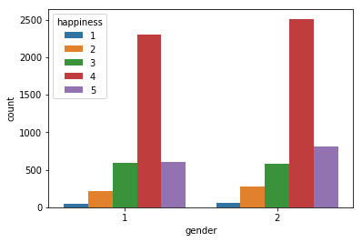
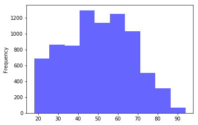
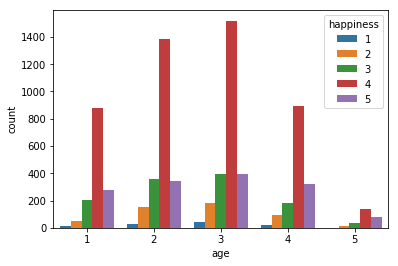
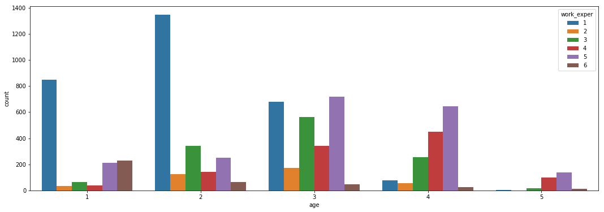

# 幸福感调查分析


```python
%matplotlib inline
import pandas as pd
import numpy as np
import matplotlib.pyplot as plt
import seaborn as sns
```

## 1. 数据处理及清洗


```python
# 导入数据，解析survey_time列的值作为独立的日期列，指定字符集类型
train = pd.read_csv('happiness_train_complete.csv', parse_dates=['survey_time'], encoding='latin-1')
test = pd.read_csv('happiness_test_complete.csv', parse_dates=['survey_time'], encoding='latin-1')
train.head()
```


<div>
<style>
    .dataframe thead tr:only-child th {
        text-align: right;
    }

    .dataframe thead th {
        text-align: left;
    }

    .dataframe tbody tr th {
        vertical-align: top;
    }
</style>
<table border="1" class="dataframe">
  <thead>
    <tr style="text-align: right;">
      <th></th>
      <th>id</th>
      <th>happiness</th>
      <th>survey_type</th>
      <th>province</th>
      <th>city</th>
      <th>county</th>
      <th>survey_time</th>
      <th>gender</th>
      <th>birth</th>
      <th>nationality</th>
      <th>...</th>
      <th>neighbor_familiarity</th>
      <th>public_service_1</th>
      <th>public_service_2</th>
      <th>public_service_3</th>
      <th>public_service_4</th>
      <th>public_service_5</th>
      <th>public_service_6</th>
      <th>public_service_7</th>
      <th>public_service_8</th>
      <th>public_service_9</th>
    </tr>
  </thead>
  <tbody>
    <tr>
      <th>0</th>
      <td>1</td>
      <td>4</td>
      <td>1</td>
      <td>12</td>
      <td>32</td>
      <td>59</td>
      <td>2015-08-04 14:18:00</td>
      <td>1</td>
      <td>1959</td>
      <td>1</td>
      <td>...</td>
      <td>4</td>
      <td>50</td>
      <td>60</td>
      <td>50</td>
      <td>50</td>
      <td>30.0</td>
      <td>30</td>
      <td>50</td>
      <td>50</td>
      <td>50</td>
    </tr>
    <tr>
      <th>1</th>
      <td>2</td>
      <td>4</td>
      <td>2</td>
      <td>18</td>
      <td>52</td>
      <td>85</td>
      <td>2015-07-21 15:04:00</td>
      <td>1</td>
      <td>1992</td>
      <td>1</td>
      <td>...</td>
      <td>3</td>
      <td>90</td>
      <td>70</td>
      <td>70</td>
      <td>80</td>
      <td>85.0</td>
      <td>70</td>
      <td>90</td>
      <td>60</td>
      <td>60</td>
    </tr>
    <tr>
      <th>2</th>
      <td>3</td>
      <td>4</td>
      <td>2</td>
      <td>29</td>
      <td>83</td>
      <td>126</td>
      <td>2015-07-21 13:24:00</td>
      <td>2</td>
      <td>1967</td>
      <td>1</td>
      <td>...</td>
      <td>4</td>
      <td>90</td>
      <td>80</td>
      <td>75</td>
      <td>79</td>
      <td>80.0</td>
      <td>90</td>
      <td>90</td>
      <td>90</td>
      <td>75</td>
    </tr>
    <tr>
      <th>3</th>
      <td>4</td>
      <td>5</td>
      <td>2</td>
      <td>10</td>
      <td>28</td>
      <td>51</td>
      <td>2015-07-25 17:33:00</td>
      <td>2</td>
      <td>1943</td>
      <td>1</td>
      <td>...</td>
      <td>3</td>
      <td>100</td>
      <td>90</td>
      <td>70</td>
      <td>80</td>
      <td>80.0</td>
      <td>90</td>
      <td>90</td>
      <td>80</td>
      <td>80</td>
    </tr>
    <tr>
      <th>4</th>
      <td>5</td>
      <td>4</td>
      <td>1</td>
      <td>7</td>
      <td>18</td>
      <td>36</td>
      <td>2015-08-10 09:50:00</td>
      <td>2</td>
      <td>1994</td>
      <td>1</td>
      <td>...</td>
      <td>2</td>
      <td>50</td>
      <td>50</td>
      <td>50</td>
      <td>50</td>
      <td>50.0</td>
      <td>50</td>
      <td>50</td>
      <td>50</td>
      <td>50</td>
    </tr>
  </tbody>
</table>
<p>5 rows × 140 columns</p>
</div>


```python
train.shape
```


    (8000, 140)


```python
o=set(train['happiness'])
print(o)
```

    {1, 2, 3, 4, 5, -8}
    


```python
# 处理异常值
# 将happiness中的‘-8’无法回答，改为‘3’说不上幸福不幸福
train['happiness'] = train['happiness'].replace(-8, 3)
```


```python
# 检查是否有缺失值
def check_missing(df):
    miss = df.isnull().sum().any()
    if miss:
        total_miss = df.isnull().sum()
        percent = (df.isnull().sum())/(df.isnull().count()*100)
        output = pd.concat([total_miss, percent], axis=1, keys=['Total', 'Percent'])
        data_type = []
        for col in df.columns:
            dType =str(df[col].dtype)
            data_type.append(dType)
        output['Types'] = data_type
        print(output[output['Total'] != 0])
        return np.transpose(output)
    else:
        return False
check_missing(train)
```

                     Total   Percent    Types
    edu_other         7997  0.009996   object
    edu_status        1120  0.001400  float64
    edu_yr            1972  0.002465  float64
    join_party        7176  0.008970  float64
    property_other    7934  0.009917   object
    hukou_loc            4  0.000005  float64
    social_neighbor    796  0.000995  float64
    social_friend      796  0.000995  float64
    work_status       5049  0.006311  float64
    work_yr           5049  0.006311  float64
    work_type         5049  0.006311  float64
    work_manage       5049  0.006311  float64
    family_income        1  0.000001  float64
    invest_other      7971  0.009964   object
    minor_child       1066  0.001332  float64
    marital_1st        828  0.001035  float64
    s_birth           1718  0.002148  float64
    marital_now       1770  0.002213  float64
    s_edu             1718  0.002148  float64
    s_political       1718  0.002148  float64
    s_hukou           1718  0.002148  float64
    s_income          1718  0.002148  float64
    s_work_exper      1718  0.002148  float64
    s_work_status     5435  0.006794  float64
    s_work_type       5435  0.006794  float64
    


<div>
<style>
    .dataframe thead tr:only-child th {
        text-align: right;
    }

    .dataframe thead th {
        text-align: left;
    }

    .dataframe tbody tr th {
        vertical-align: top;
    }
</style>
<table border="1" class="dataframe">
  <thead>
    <tr style="text-align: right;">
      <th></th>
      <th>id</th>
      <th>happiness</th>
      <th>survey_type</th>
      <th>province</th>
      <th>city</th>
      <th>county</th>
      <th>survey_time</th>
      <th>gender</th>
      <th>birth</th>
      <th>nationality</th>
      <th>...</th>
      <th>neighbor_familiarity</th>
      <th>public_service_1</th>
      <th>public_service_2</th>
      <th>public_service_3</th>
      <th>public_service_4</th>
      <th>public_service_5</th>
      <th>public_service_6</th>
      <th>public_service_7</th>
      <th>public_service_8</th>
      <th>public_service_9</th>
    </tr>
  </thead>
  <tbody>
    <tr>
      <th>Total</th>
      <td>0</td>
      <td>0</td>
      <td>0</td>
      <td>0</td>
      <td>0</td>
      <td>0</td>
      <td>0</td>
      <td>0</td>
      <td>0</td>
      <td>0</td>
      <td>...</td>
      <td>0</td>
      <td>0</td>
      <td>0</td>
      <td>0</td>
      <td>0</td>
      <td>0</td>
      <td>0</td>
      <td>0</td>
      <td>0</td>
      <td>0</td>
    </tr>
    <tr>
      <th>Percent</th>
      <td>0</td>
      <td>0</td>
      <td>0</td>
      <td>0</td>
      <td>0</td>
      <td>0</td>
      <td>0</td>
      <td>0</td>
      <td>0</td>
      <td>0</td>
      <td>...</td>
      <td>0</td>
      <td>0</td>
      <td>0</td>
      <td>0</td>
      <td>0</td>
      <td>0</td>
      <td>0</td>
      <td>0</td>
      <td>0</td>
      <td>0</td>
    </tr>
    <tr>
      <th>Types</th>
      <td>int64</td>
      <td>int64</td>
      <td>int64</td>
      <td>int64</td>
      <td>int64</td>
      <td>int64</td>
      <td>datetime64[ns]</td>
      <td>int64</td>
      <td>int64</td>
      <td>int64</td>
      <td>...</td>
      <td>int64</td>
      <td>int64</td>
      <td>int64</td>
      <td>int64</td>
      <td>int64</td>
      <td>float64</td>
      <td>int64</td>
      <td>int64</td>
      <td>int64</td>
      <td>int64</td>
    </tr>
  </tbody>
</table>
<p>3 rows × 140 columns</p>
</div>


```python
# 填充缺失值，hukou_loc、family_income以均值填充
train['hukou_loc'] = train['hukou_loc'] .fillna(4)
train['family_income'] = train['family_income'] .fillna(train['family_income'].mean())
```


```python
# 计算调查者年龄，调查年份-出生年份
import datetime
train['survey_time'] = train['survey_time'].dt.year  # 调查时间datetime转换为年
train['age'] = train['survey_time'] - train['birth']
test['survey_time'] = test['survey_time'].dt.year  
test['age'] = test['survey_time'] - test['birth']
train['age'].head()
```


    0    56
    1    23
    2    48
    3    72
    4    21
    Name: age, dtype: int64


## 2. 描述性分析


```python
# 显示数据的统计量，均值、标准差、最小值、分位数、最大值
train.describe()
```


<div>
<style>
    .dataframe thead tr:only-child th {
        text-align: right;
    }

    .dataframe thead th {
        text-align: left;
    }

    .dataframe tbody tr th {
        vertical-align: top;
    }
</style>
<table border="1" class="dataframe">
  <thead>
    <tr style="text-align: right;">
      <th></th>
      <th>id</th>
      <th>happiness</th>
      <th>survey_type</th>
      <th>province</th>
      <th>city</th>
      <th>county</th>
      <th>survey_time</th>
      <th>gender</th>
      <th>birth</th>
      <th>nationality</th>
      <th>...</th>
      <th>public_service_1</th>
      <th>public_service_2</th>
      <th>public_service_3</th>
      <th>public_service_4</th>
      <th>public_service_5</th>
      <th>public_service_6</th>
      <th>public_service_7</th>
      <th>public_service_8</th>
      <th>public_service_9</th>
      <th>age</th>
    </tr>
  </thead>
  <tbody>
    <tr>
      <th>count</th>
      <td>8000.00000</td>
      <td>8000.000000</td>
      <td>8000.000000</td>
      <td>8000.000000</td>
      <td>8000.000000</td>
      <td>8000.000000</td>
      <td>8000.0</td>
      <td>8000.00000</td>
      <td>8000.000000</td>
      <td>8000.00000</td>
      <td>...</td>
      <td>8000.000000</td>
      <td>8000.000000</td>
      <td>8000.000000</td>
      <td>8000.000000</td>
      <td>8000.000000</td>
      <td>8000.000000</td>
      <td>8000.00000</td>
      <td>8000.000000</td>
      <td>8000.000000</td>
      <td>8000.000000</td>
    </tr>
    <tr>
      <th>mean</th>
      <td>4000.50000</td>
      <td>3.866625</td>
      <td>1.405500</td>
      <td>15.155375</td>
      <td>42.564750</td>
      <td>70.619000</td>
      <td>2015.0</td>
      <td>1.53000</td>
      <td>1964.707625</td>
      <td>1.37350</td>
      <td>...</td>
      <td>70.809500</td>
      <td>68.170000</td>
      <td>62.737625</td>
      <td>66.320125</td>
      <td>62.794187</td>
      <td>67.064000</td>
      <td>66.09625</td>
      <td>65.626750</td>
      <td>67.153750</td>
      <td>50.292375</td>
    </tr>
    <tr>
      <th>std</th>
      <td>2309.54541</td>
      <td>0.818792</td>
      <td>0.491019</td>
      <td>8.917100</td>
      <td>27.187404</td>
      <td>38.747503</td>
      <td>0.0</td>
      <td>0.49913</td>
      <td>16.842865</td>
      <td>1.52882</td>
      <td>...</td>
      <td>21.184742</td>
      <td>20.549943</td>
      <td>24.771319</td>
      <td>22.049437</td>
      <td>23.463162</td>
      <td>21.586817</td>
      <td>23.08568</td>
      <td>23.827493</td>
      <td>22.502203</td>
      <td>16.842865</td>
    </tr>
    <tr>
      <th>min</th>
      <td>1.00000</td>
      <td>1.000000</td>
      <td>1.000000</td>
      <td>1.000000</td>
      <td>1.000000</td>
      <td>1.000000</td>
      <td>2015.0</td>
      <td>1.00000</td>
      <td>1921.000000</td>
      <td>-8.00000</td>
      <td>...</td>
      <td>-3.000000</td>
      <td>-3.000000</td>
      <td>-3.000000</td>
      <td>-3.000000</td>
      <td>-3.000000</td>
      <td>-3.000000</td>
      <td>-3.00000</td>
      <td>-3.000000</td>
      <td>-3.000000</td>
      <td>18.000000</td>
    </tr>
    <tr>
      <th>25%</th>
      <td>2000.75000</td>
      <td>4.000000</td>
      <td>1.000000</td>
      <td>7.000000</td>
      <td>18.000000</td>
      <td>37.000000</td>
      <td>2015.0</td>
      <td>1.00000</td>
      <td>1952.000000</td>
      <td>1.00000</td>
      <td>...</td>
      <td>60.000000</td>
      <td>60.000000</td>
      <td>50.000000</td>
      <td>60.000000</td>
      <td>55.000000</td>
      <td>60.000000</td>
      <td>60.00000</td>
      <td>60.000000</td>
      <td>60.000000</td>
      <td>38.000000</td>
    </tr>
    <tr>
      <th>50%</th>
      <td>4000.50000</td>
      <td>4.000000</td>
      <td>1.000000</td>
      <td>15.000000</td>
      <td>42.000000</td>
      <td>73.000000</td>
      <td>2015.0</td>
      <td>2.00000</td>
      <td>1965.000000</td>
      <td>1.00000</td>
      <td>...</td>
      <td>79.000000</td>
      <td>70.000000</td>
      <td>70.000000</td>
      <td>70.000000</td>
      <td>70.000000</td>
      <td>70.000000</td>
      <td>70.00000</td>
      <td>70.000000</td>
      <td>70.000000</td>
      <td>50.000000</td>
    </tr>
    <tr>
      <th>75%</th>
      <td>6000.25000</td>
      <td>4.000000</td>
      <td>2.000000</td>
      <td>22.000000</td>
      <td>65.000000</td>
      <td>104.000000</td>
      <td>2015.0</td>
      <td>2.00000</td>
      <td>1977.000000</td>
      <td>1.00000</td>
      <td>...</td>
      <td>80.000000</td>
      <td>80.000000</td>
      <td>80.000000</td>
      <td>80.000000</td>
      <td>80.000000</td>
      <td>80.000000</td>
      <td>80.00000</td>
      <td>80.000000</td>
      <td>80.000000</td>
      <td>63.000000</td>
    </tr>
    <tr>
      <th>max</th>
      <td>8000.00000</td>
      <td>5.000000</td>
      <td>2.000000</td>
      <td>31.000000</td>
      <td>89.000000</td>
      <td>134.000000</td>
      <td>2015.0</td>
      <td>2.00000</td>
      <td>1997.000000</td>
      <td>8.00000</td>
      <td>...</td>
      <td>100.000000</td>
      <td>100.000000</td>
      <td>100.000000</td>
      <td>100.000000</td>
      <td>100.000000</td>
      <td>100.000000</td>
      <td>100.00000</td>
      <td>100.000000</td>
      <td>100.000000</td>
      <td>94.000000</td>
    </tr>
  </tbody>
</table>
<p>8 rows × 138 columns</p>
</div>


```python
# 年龄与幸福指数的pearson相关系数，几乎不相关
train['happiness'].corr(train['age'], method='pearson') 
```


    0.004704486424158736


```python
# 家庭收入与幸福指数的pearson相关系数，几乎不相关
train['happiness'].corr(train['family_income'], method='pearson') 
```


    0.05168655743647719


## 3. 探索性分析


```python
# 5个等级幸福感的柱状图，5个等级的占比图
f,ax=plt.subplots(1,2,figsize=(14,6))
# 部分分离开
explode = (0.05,0.05,0,0,0)
train['happiness'].value_counts().plot.pie(autopct='%1.1f%%',ax=ax[0],shadow=True,explode=explode)
ax[0].set_xlabel('happiness_level')
# 用seaborn的计数图
sns.countplot('happiness',data=train,ax=ax[1])
# ax[1] = train['happiness'].value_counts().plot.bar()
ax[1].set_title('How much people are happy',fontsize=15)
ax[1].set_xlabel('happiness_level')
ax[1].set_ylabel('number')
plt.show() 
```


```python
## 分性别分析,1男，2女
train.groupby(['gender', 'happiness'])['happiness'].count()
```


    gender  happiness
    1       1              43
            2             216
            3             596
            4            2306
            5             599
    2       1              61
            2             281
            3             575
            4            2512
            5             811
    Name: happiness, dtype: int64


```python
# 男女的幸福指数比较
# hue为色彩色度的意思，可以理解为hue决定具有多彩的标签
sns.countplot(x='gender', hue='happiness', data=train)
plt.title('The number of people with different happiness level by sex',fontsize=15)
```


    <matplotlib.text.Text at 0x1297f278>





```python
# 样本类型的幸福指数比较，1表示城市，2表示农村
sns.countplot(x='survey_type', hue='happiness', data=train)
plt.title('The number of people with different happiness level by sample type',fontsize=15)
```


    <matplotlib.text.Text at 0x126e2518>





```python
# 将年龄分阶段
## 按每个年龄阶段分析幸福感
# train.dtypes
combine=[train,test]
for dataset in combine:
    dataset.loc[dataset['age']<=16,'age']=0
    dataset.loc[(dataset['age'] > 16) & (dataset['age'] <= 32), 'age'] = 1
    dataset.loc[(dataset['age'] > 32) & (dataset['age'] <= 48), 'age'] = 2
    dataset.loc[(dataset['age'] > 48) & (dataset['age'] <= 64), 'age'] = 3
    dataset.loc[(dataset['age'] > 64) & (dataset['age'] <= 80), 'age'] = 4
    dataset.loc[ dataset['age'] > 80, 'age'] = 5 
sns.countplot('age',hue='happiness',data=train)
plt.title('The number of people with different happiness level in 5 age',fontsize=15)
train['age'] = train['age'].astype(int)
```





```python
## 分年龄分析
# 绘制条形图，得到每个年龄段的频数
plt.hist(train['age'], range=(1,6), histtype='bar', align='left', color='blue',alpha=0.5)
plt.title('The number of people in 5 age',fontsize=15)
plt.xlabel('age: 1->16-32,2->32-48,3->48-64,3->64-80,5->80-.')
plt.ylabel('The number of people')
```


    <matplotlib.text.Text at 0x12363358>


```python
# 在各个年龄段中，5个happiness level所占比例pie图
fig,ax1 = plt.subplots(1,5,figsize=(20,4))
# 部分分离开
explode = (0.05,0.03,0,0,0)
train['happiness'][train['age']==1].value_counts().plot.pie(autopct='%1.1f%%', ax=ax1[0], explode=explode)
train['happiness'][train['age']==2].value_counts().plot.pie(autopct='%1.1f%%', ax=ax1[1], explode=explode)
train['happiness'][train['age']==3].value_counts().plot.pie(autopct='%1.1f%%', ax=ax1[2], explode=explode)
train['happiness'][train['age']==4].value_counts().plot.pie(autopct='%1.1f%%', ax=ax1[3], explode=explode)
train['happiness'][train['age']==5].value_counts().plot.pie(autopct='%1.1f%%', ax=ax1[4], explode=explode)
fig.suptitle('The proportion of happiness level in differenr age', fontsize=18, verticalalignment='center')
```


    <matplotlib.text.Text at 0x122d3588>





```python
# 每个年龄段的具有不同工作经历的人数
f,ax = plt.subplots(1,1,figsize=(10,6))
sns.countplot('age',hue='work_exper', data=train)
plt.title('The number of people with different work experence by age',fontsize=15)
```


    <matplotlib.text.Text at 0x12363400>


```python
# 绘制热图，热图的用途: seaborn中的heatmap热力图可以得到数据表里多个特征两两的相关度（pearson相关系数计算的）
# data.corr()：得到关联矩阵，cmap: 从数字到色彩空间的映射，取值是matplotlib包里的colormap名称或颜色对象，
# annot(annotate的缩写): 默认取值False；如果是True，在热力图每个方格写入数据
# linewidths:定义热力图里“表示两两特征关系的矩阵小块”之间的间隔大小
#外界层面（物质）：age，inc_ability，gender，status_peer，family_status，equity，class，income，house，survey_type，
#个人层面（精神）：health，work_exper，health_problem，depression，learn，relax，edu，social_friend,marital,work_status
sns.heatmap(train[['happiness','age','inc_ability','gender','status_peer','family_status','health','equity','class','work_exper',
                   'health_problem','income','house','depression','learn','relax','edu','social_friend','marital','work_status']].corr(),
            annot=True,cmap='RdYlGn',linewidths=0.2) 
fig=plt.gcf() # 获取当前的figure
fig.set_size_inches(12,10) # 设置尺寸
plt.title('The correlation between features by heatmap',fontsize=18)
plt.show()
```


```python
train.head()
```


<div>
<style>
    .dataframe thead tr:only-child th {
        text-align: right;
    }

    .dataframe thead th {
        text-align: left;
    }

    .dataframe tbody tr th {
        vertical-align: top;
    }
</style>
<table border="1" class="dataframe">
  <thead>
    <tr style="text-align: right;">
      <th></th>
      <th>id</th>
      <th>happiness</th>
      <th>survey_type</th>
      <th>province</th>
      <th>city</th>
      <th>county</th>
      <th>survey_time</th>
      <th>gender</th>
      <th>birth</th>
      <th>nationality</th>
      <th>...</th>
      <th>public_service_1</th>
      <th>public_service_2</th>
      <th>public_service_3</th>
      <th>public_service_4</th>
      <th>public_service_5</th>
      <th>public_service_6</th>
      <th>public_service_7</th>
      <th>public_service_8</th>
      <th>public_service_9</th>
      <th>age</th>
    </tr>
  </thead>
  <tbody>
    <tr>
      <th>0</th>
      <td>1</td>
      <td>4</td>
      <td>1</td>
      <td>12</td>
      <td>32</td>
      <td>59</td>
      <td>2015</td>
      <td>1</td>
      <td>1959</td>
      <td>1</td>
      <td>...</td>
      <td>50</td>
      <td>60</td>
      <td>50</td>
      <td>50</td>
      <td>30.0</td>
      <td>30</td>
      <td>50</td>
      <td>50</td>
      <td>50</td>
      <td>3</td>
    </tr>
    <tr>
      <th>1</th>
      <td>2</td>
      <td>4</td>
      <td>2</td>
      <td>18</td>
      <td>52</td>
      <td>85</td>
      <td>2015</td>
      <td>1</td>
      <td>1992</td>
      <td>1</td>
      <td>...</td>
      <td>90</td>
      <td>70</td>
      <td>70</td>
      <td>80</td>
      <td>85.0</td>
      <td>70</td>
      <td>90</td>
      <td>60</td>
      <td>60</td>
      <td>1</td>
    </tr>
    <tr>
      <th>2</th>
      <td>3</td>
      <td>4</td>
      <td>2</td>
      <td>29</td>
      <td>83</td>
      <td>126</td>
      <td>2015</td>
      <td>2</td>
      <td>1967</td>
      <td>1</td>
      <td>...</td>
      <td>90</td>
      <td>80</td>
      <td>75</td>
      <td>79</td>
      <td>80.0</td>
      <td>90</td>
      <td>90</td>
      <td>90</td>
      <td>75</td>
      <td>2</td>
    </tr>
    <tr>
      <th>3</th>
      <td>4</td>
      <td>5</td>
      <td>2</td>
      <td>10</td>
      <td>28</td>
      <td>51</td>
      <td>2015</td>
      <td>2</td>
      <td>1943</td>
      <td>1</td>
      <td>...</td>
      <td>100</td>
      <td>90</td>
      <td>70</td>
      <td>80</td>
      <td>80.0</td>
      <td>90</td>
      <td>90</td>
      <td>80</td>
      <td>80</td>
      <td>4</td>
    </tr>
    <tr>
      <th>4</th>
      <td>5</td>
      <td>4</td>
      <td>1</td>
      <td>7</td>
      <td>18</td>
      <td>36</td>
      <td>2015</td>
      <td>2</td>
      <td>1994</td>
      <td>1</td>
      <td>...</td>
      <td>50</td>
      <td>50</td>
      <td>50</td>
      <td>50</td>
      <td>50.0</td>
      <td>50</td>
      <td>50</td>
      <td>50</td>
      <td>50</td>
      <td>1</td>
    </tr>
  </tbody>
</table>
<p>5 rows × 141 columns</p>
</div>


```python
train.select_dtypes(include=['object']).head()
```


<div>
<style>
    .dataframe thead tr:only-child th {
        text-align: right;
    }

    .dataframe thead th {
        text-align: left;
    }

    .dataframe tbody tr th {
        vertical-align: top;
    }
</style>
<table border="1" class="dataframe">
  <thead>
    <tr style="text-align: right;">
      <th></th>
      <th>edu_other</th>
      <th>property_other</th>
      <th>invest_other</th>
    </tr>
  </thead>
  <tbody>
    <tr>
      <th>0</th>
      <td>NaN</td>
      <td>NaN</td>
      <td>NaN</td>
    </tr>
    <tr>
      <th>1</th>
      <td>NaN</td>
      <td>NaN</td>
      <td>NaN</td>
    </tr>
    <tr>
      <th>2</th>
      <td>NaN</td>
      <td>NaN</td>
      <td>NaN</td>
    </tr>
    <tr>
      <th>3</th>
      <td>NaN</td>
      <td>NaN</td>
      <td>NaN</td>
    </tr>
    <tr>
      <th>4</th>
      <td>NaN</td>
      <td>NaN</td>
      <td>NaN</td>
    </tr>
  </tbody>
</table>
</div>


```python
dellist = ['edu_other','property_other','invest_other']
for i in dellist:
    del train[i]
    del test[i]
```


```python
train.to_csv('happiness_train_clean.csv',index=0)
test.to_csv('happiness_test_clean.csv',index=0)
```


```python
# train.dtypes
```
